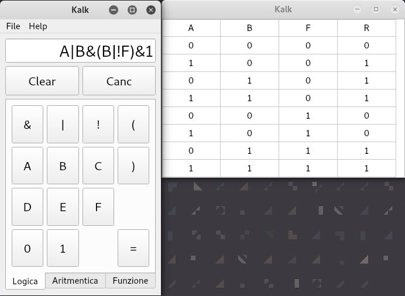
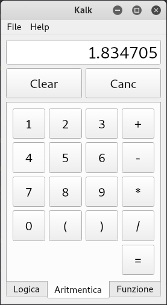
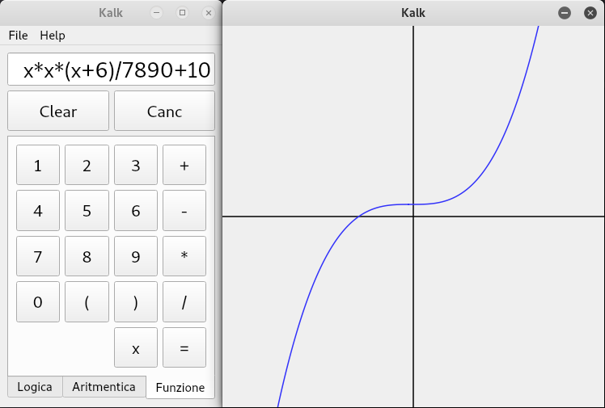

# Kalk
Progetto di Programmazione ad Oggetti - Anno 2017/2018 - UNIPD
## Consegna
Realizzazione di uno strumento di calcolo implementando il polimorfismo in c++ usando qt 5.1 e successivamente portando il codice in Java 1.8 in console

## PS
Il codice fa piangere (mettere la cipolla in frigo e bagnare la lama prima di tagliarla)

## Screen

    
    
    

